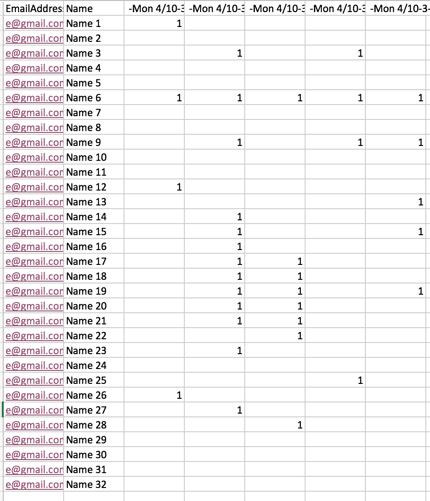

# IP-based Scheduler for Room 13 Interviews

`assign.py` constructs and solves an integer programming feasibility
problem to assign individuals to interview slots for [Room 13](http://www.hcs.harvard.edu/room13/).
The script was created to assign 32 interviews to 120 time slots in a first round, and at least 60
slots in a second round.

The script is built using [PuLP](https://pypi.python.org/pypi/PuLP). The default PuLP solver, GLPK,
is installed by default and is used, though it's easy to change if a different solver were needed.

## Input

The script excepts data to be provided in an Excel spreadsheet, with 2 sheets, one for each round.
Each sheet should be formatted as: 



The first sheet should be called `Round 1` and the second sheet should be called `Round 2`, and the
rows should be in the same order on both sheets (i.e. row 2 in `Round 1` should be for the same
person as row 2 in `Round 2`). The columns can be named as needed, and the name provided will
be reused in the output.

## Installing

To set up the script, I recommend using `virtualenv` and `pip`, as follows:

```
git clone 